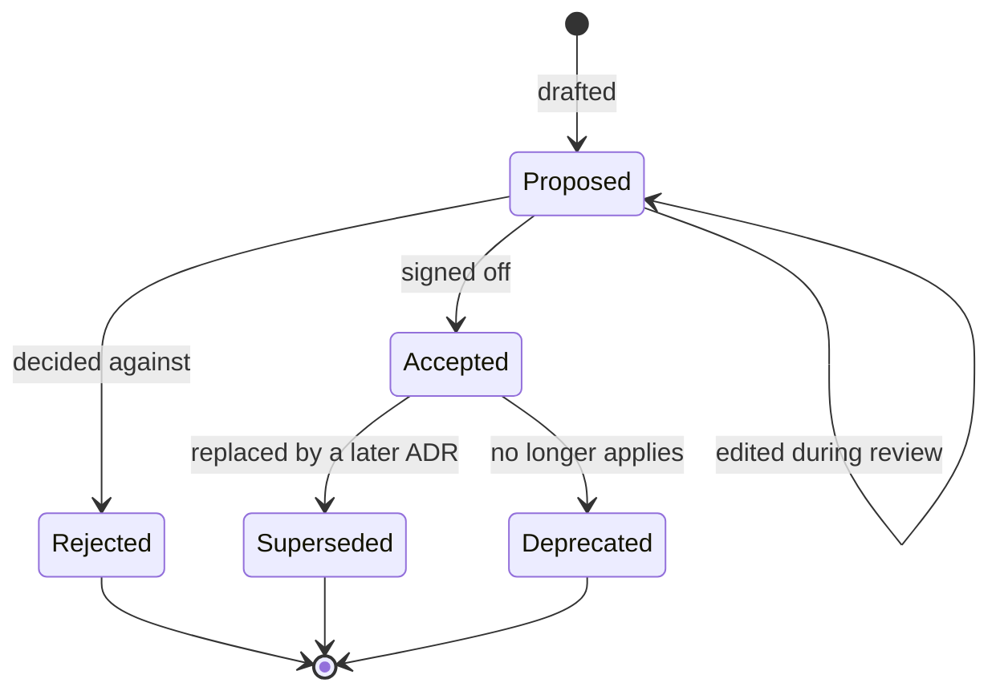

# Architecture Decision Records

Architecture Decision Records for aws-databricks-lakehouse.

## Index

| ADR | Title | Status |
|-----|-------|--------|
| [0001](0001-aws-and-databricks-lakehouse.md) | AWS and Databricks lakehouse | **Accepted** |
| [0002](0002-databricks-over-emr.md) | choosing Databricks over EMR | *Proposed* |
| [0003](0003-region-frankfurt.md) | Frankfurt (eu-central-1) as the region | **Accepted** |
| [0004](0004-ride-hailing-dataset.md) | Ride-hailing as the dataset domain | **Accepted** |
| [0005](0005-source-control-and-ci.md) | Source control and CI | **Accepted** |
| [0006](0006-pii-gdpr-governance-lineage.md) | PII, GDPR, governance, and lineage | *Proposed* |
| [0007](0007-terraform-structure-and-state.md) | Terraform structure and state | **Accepted** |
| [0008](0008-synthetic-data-generator-and-local-source.md) | The synthetic data generator and its local source | **Accepted** |
| [0009](0009-streaming-events-through-kinesis.md) | Streaming the trip events through Kinesis | **Accepted** |
| [0010](0010-hybrid-connectivity-simulated-on-prem.md) | A simulated on-prem VPC reached over a Site-to-Site VPN | *Proposed* |
| [0011](0011-cdc-landing-with-dms.md) | Landing OLTP changes in the lake with DMS | *Proposed* |
| [0012](0012-pii-in-the-cdc-path.md) | Personal data on the change-capture path | *Proposed* |
| [0013](0013-ci-applies-with-approval.md) | CI applies to AWS, manually triggered with approval | **Accepted** |

## ADR status model
Status tells a reader whether a decision is still open or settled. The fine-grained, per-component build details live in the README status table, this index only tracks the decision itself.

| Status | Meaning |
|---|---|
| *Proposed* | Written and under review. Still open to challenge, nothing is built against it yet. |
| **Accepted** | Signed off. This is the decision the project builds against. |
| Rejected | Weighed and turned down. Kept on record so the reasoning behind the road not taken survives. |
| Superseded | Replaced by a later ADR. Links to the one that took over. The original stays for history. |
| Deprecated | No longer applies, and nothing replaced it. Usually a dropped component. |

## Lifecycle

## Rules

A Proposed ADR gets edited freely while it's under review. Once it's Accepted the decision is frozen. If it changes later the ADR is not rewritten. A new ADR is written instead. The old one is marked Superseded, and the two are linked. That trail is deliberate, it shows how the thinking moved across the project rather than hiding the dead ends.
