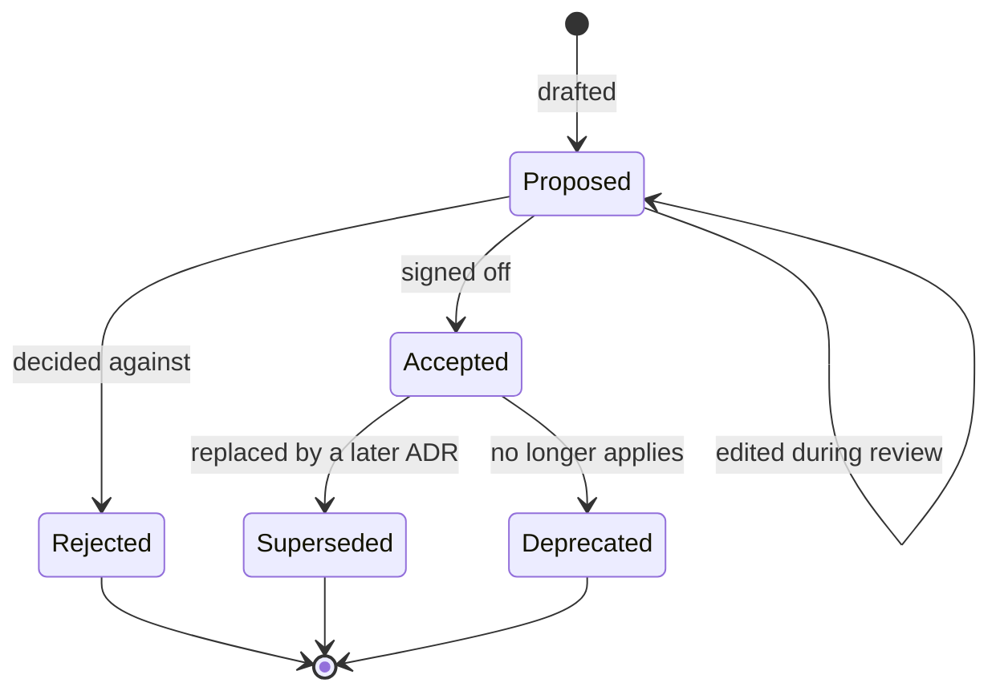

# Architecture Decision Records

This directory tracks Architecture Decision Records (ADRs) for the aws-databricks-lakehouse
project. Each ADR captures a significant architectural decision, the context that drove it, and
its consequences.

## Index

| ADR | Title | Status |
|-----|-------|--------|
| [0001](0001-aws-and-databricks-lakehouse.md) | AWS and Databricks lakehouse | Proposed |
| [0002](0002-databricks-over-emr.md) | choosing Databricks over EMR | Proposed |
| [0003](0003-region-frankfurt.md) | Frankfurt (eu-central-1) as the region | Proposed |
| [0004](0004-ride-hailing-dataset.md) | Ride-hailing as the dataset domain | Proposed |
| [0005](0005-source-control-and-ci.md) | Source control and CI | Proposed |
| [0006](0006-pii-gdpr-governance-lineage.md) | PII, GDPR, governance, and lineage | Proposed |
| [0007](0007-terraform-structure-and-state.md) | Terraform structure and state | Proposed |

## ADR status model
Status tells a reader where a decision stands. It says nothing about whether the thing is built yet. Build state lives in the README status table and is tracked separately.

| Status | Meaning |
|---|---|
| Proposed | Written and under review. Still open to challenge, nothing is built against it yet. |
| Accepted | Signed off. This is the decision the project builds against. |
| Rejected | Weighed and turned down. Kept on record so the reasoning behind the road not taken survives. |
| Superseded | Replaced by a later ADR. Links to the one that took over. The original stays for history. |
| Deprecated | No longer applies, and nothing replaced it. Usually a dropped component. |

## Lifecycle

## Rules

A Proposed ADR gets edited freely while it's under review. Once it's Accepted the decision is frozen. If it changes later the ADR is not rewritten. A new ADR is written instead, the old one is marked Superseded, and the two are linked. That trail is deliberate, it shows how the thinking moved across the project rather than hiding the dead ends.
