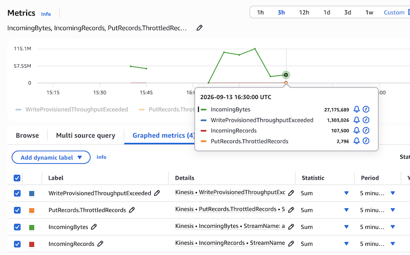
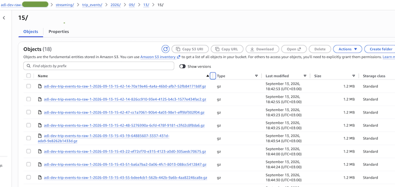

# Phase 3 streaming load test

This is what I did to the Kinesis stream once it was live, and what came out
of it. The stream and the producer are covered in ADR-0009. This note is the
run itself, the numbers, and the one thing that didn't work.

## What I built to test

The producer is `generator/stream.py`. It reads the events NDJSON that the
files target writes, so it never regenerates, it just sends what's already on
disk. It sends with `put_records` in batches and stays inside the three real
limits, 500 records a call, 5 MB a call, and 1 MB a record. When a batch comes
back with failed records, it resends only those, with backoff. That last part
is the point. `put_records` can return a success at the HTTP level while some
records inside it were rejected, so a producer that ignores the failed count
drops data without knowing.

The stream is provisioned with two shards and encrypted with KMS. The Firehose
delivery stream reads the stream and lands the raw events in the raw bucket.

## The first run, normal volume

The first send was only to see the pipe work. Events went in, Firehose read
them out, and nothing failed. Write throughput sat around a quarter of a MiB a
second against the two shard ceiling of two MiB a second, so the stream was
barely working and nothing throttled. That was expected, the point was to prove
the path end to end.

## Forcing the throttle

To make the stream push back I had to raise the rate, not the total, because
throttling is about records a second and not how many records there are
overall.

To achieve this, I 8 parallel execution of generate command and all those together combined were able to exceed the threshhold and make the test-case possible.

Once the rate crossed what two shards can take, the stream started rejecting
writes. Over one five minute window, measured as a sum:

- `WriteProvisionedThroughputExceeded` reached 1,303,026
- `PutRecords.ThrottledRecords` reached 2,796
- `IncomingRecords` was 107,500 and `IncomingBytes` was about 27 MB in the same window

Non-zero throttling is the whole thing I was after. It means the stream hit its
ceiling and pushed back. The records still landed though, because the producer
caught the rejected ones and resent them with backoff. So the stream throttled,
the producer handled it the right way, and no data was lost.

One thing worth saying about reading these. The console shows Average by
default, and an average over five minutes hides the spikes, so the real
per-second throttling was worse than an average makes it look. Sum is the
honest statistic here, which is what the numbers above use.

## The landing

Firehose buffered the events and wrote them to the raw bucket as gzip files,
each about 1.2 MB, partitioned by date. They landed under
`streaming/trip_events/2026/09/13/15/`. So the full path held, stream to
Firehose to the lake, and the raw zone got compressed, date-partitioned files
without me doing anything on the S3 side.

## The hot shard, and what stopped me

The second story I wanted was a hot shard, where a skewed partition key piles
most of the load onto one shard while the other sits idle. The plan was to key
the events on pickup zone so the busy zones swamp one shard, then re-key by
trip_id to spread them.

I couldn't finish it, and the reason is worth writing down. When I went to read
per-shard `IncomingRecords`, the query came back empty, while the stream-level
metric had plenty of data. The cause is that shard-level metrics are off by
default, so Kinesis was never collecting per-shard data for me to look at.
Stream-level metrics are always there, per-shard ones only exist if you turn on
enhanced monitoring first. So there was nothing to graph. That wasn't the load
being even, it was the data never being recorded in the first place.

It's the kind of thing you only hit by running it, you don't get the per-shard
view unless you turn it on before you push the load.

## Follow-ups

- Turn on enhanced monitoring on the stream, then rerun the zone-keyed send, so
  the per-shard skew and the hot shard actually show up.
- Show the re-key fix, pickup zone to trip_id, once the per-shard view works.
- The producer already takes a partition key flag for exactly this, so it's the
  monitoring and a rerun that are missing.

## Cost

The stream billed for the length of the session and was torn down with
`terraform destroy` at the end. Two shards is a few cents an hour, and the stack
is built to be destroyed and rebuilt, so nothing is left running.
