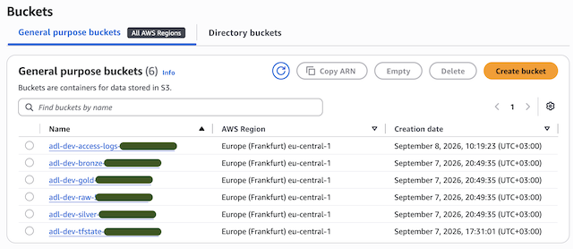

# lake_bucket

A hardened S3 bucket, used for every bucket in the lake. Rather than set the same safe options on each bucket by hand, they all come from this one module, so the setup is written once.

## What it creates

- An S3 bucket.
- Versioning on.
- Encryption with a KMS key, with bucket keys on to cut KMS cost.
- Public access blocked, all four settings.
- A bucket policy that denies any non-TLS access.
- A lifecycle rule that aborts failed multipart uploads after 7 days. If `expire_days` is above 0, it also expires current and old versions after that many days.
- Access logging to another bucket, only when `logging_target_bucket` is set.

## Inputs

| Name | Description | Default |
|---|---|---|
| `bucket_name` | Full bucket name | — |
| `kms_key_arn` | KMS key used to encrypt the bucket | — |
| `component` | Tag for the layer or use, e.g. `raw`, `bronze`, `access-logs` | — |
| `expire_days` | Days before objects expire. 0 means no expiry | `0` |
| `logging_target_bucket` | Bucket that receives access logs. Empty means no logging | `""` |

## Outputs

`bucket_name`, `bucket_arn`
