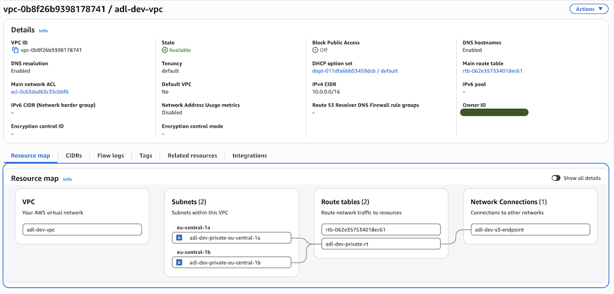

# network

A VPC across two AZs with private subnets only. No NAT gateway, no internet gateway, no public subnets. This environment does not need outbound internet, and adding that later is cheap. Building it in now just in case is harder to undo later.

## What it creates

- A VPC, with DNS support and hostnames on.
- One private subnet per AZ (`az_count`, default 2), cut as `/24`s from `vpc_cidr`.
- A shared route table for the private subnets, with an S3 gateway endpoint attached. That is the only way out, so the private subnets can reach the lake buckets with no internet path.
- The VPC default security group, locked to no ingress and no egress (CKV2_AWS_12).
- VPC flow logs for all traffic, sent to a CloudWatch log group that is KMS-encrypted and kept 14 days (a dev cost tradeoff, see `.checkov.yaml`).

## Inputs

| Name | Description | Default |
|---|---|---|
| `name_prefix` | Prefix for every resource name, e.g. `adl-dev` | — |
| `vpc_cidr` | CIDR block for the VPC | `10.0.0.0/16` |
| `az_count` | Number of AZs to spread private subnets across | `2` |
| `region` | AWS region | — |
| `kms_key_arn` | KMS key that encrypts the flow logs log group | — |

## Outputs

`vpc_id`, `private_subnet_ids`, `private_route_table_id`
